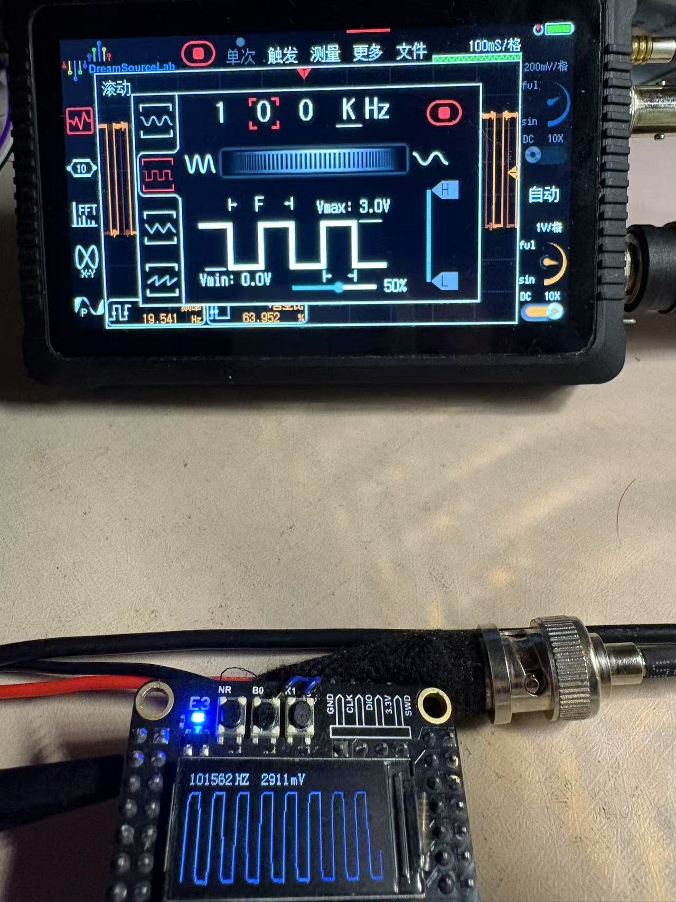

# 2025年夏季单片机课程设计：基于STM32H750VBT6的示波器
## 演示图

图示为示波器显示100Khz方波图像
## 参数
ADC位数：8 bit
采样率：2M sa/s
存储深度：10K byte
## 硬件平台
Weact Studio 淘宝店出售的STM32H750VBT6最小系统板
## 技术细节
### ADC数据采样部分：
使用TIM定时触发ADC，DMA搬运ADC的DR寄存器数据到指定缓冲区：
- 定时器：
  - 配置2M的更新频率，并将更新事件映射为TRGO输出
- ADC：
  - 配置单次转换模式，8bit分辨率（出于DMA搬运效率考虑，相较于12位和16位可以降低总线的负载），触发源为定时器的TRGO输出
- DMA：
  - 循环模式
  - 源地址为ADC的DR寄存器，宽度为byte；目的地址为指定内存，宽度为word
  - 开启满的FIFO
  - 源地址到FIFO搬运不使用burst，也不能使用，因为一次本来就一个宽度的数据
  - FIFO到目的地址搬运可以开启一定大小的burst，这会提高DMA搬运的效率，但是可能会造成总线上其他主设备例如CPU访问总线的延迟，系统可能会出现一些不可名状的错误。
### DMA搬运缓存更新太快来不及处理的解决方法
在DMA搬运完成中断回调函数里面置计数器，以跳过一些数据不去处理
需要处理的DMA缓冲区需要被深拷贝到另外一个缓冲区，这样可以后续处理这些数据而不被覆盖
大块内存搬运的方案：   
- 直接逐字节赋值
```c
for(uint16_t i=0; i<BUFFER_SIZE; i++)
{
    buffer_copy[i] = buffer_dma[i];
}
```
由于总线是32位的所以实际利用率仅为25%，所以可以按word访问来优化
- 逐word搬运
```c
for(uint16_t i=0; i<BUFFER_SIZE/4; i++)
{
    *(uint32_t*)(buffer_copy + i) = *(uint32_t*)(buffer_dma + i);
}
```
由于buffer_copy和buffer_dma数组的类型是uint8_t，连接器按照自然对其不会让他4字节对齐，但是我们这里强转为uint32_t去访问的话4字节对齐的地址效率相对没有4字节对齐的效率要高，所以需要根据指定编译器去将buffer_copy和buffer_dma的地址4字节对齐。
这种方法虽然效率是第一种的4倍，但是本质上还是要CPU搬运，在cpu性能不高的场景下搬运大块数据还是很慢，引入第三种解决方法，使用dma
- 使用dma搬运
为了充分利用H7上的DMA，使用MTM模式，开启满的FIFO和满的burst,
源地址和目标地址的宽度都设为WORD，所起也是需要buffer_copy和buffer_dma这两个uint8_t类型的数据的首地址需要人为的强制4字节对齐以达到最大效率
```c
HAL_DMA_Start(&hdma_memtomem_dma2_stream1, (uint32_t)adc_buffer, (uint32_t)adc_buffer_copy, SAMPLING_DEPTH/4);
```


